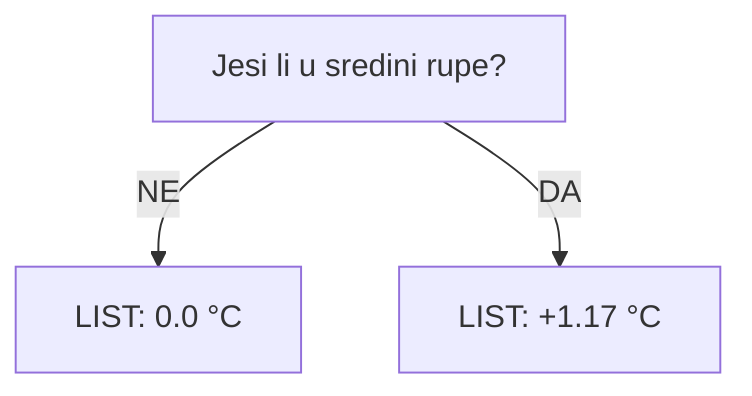
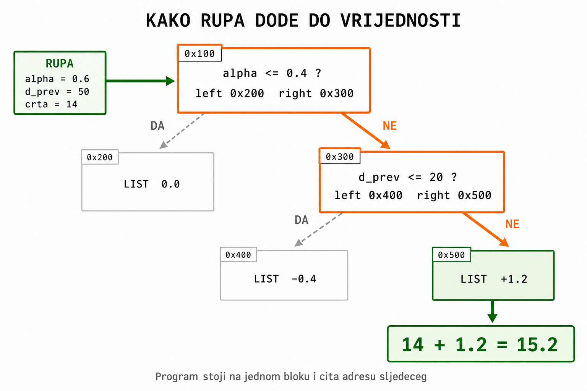
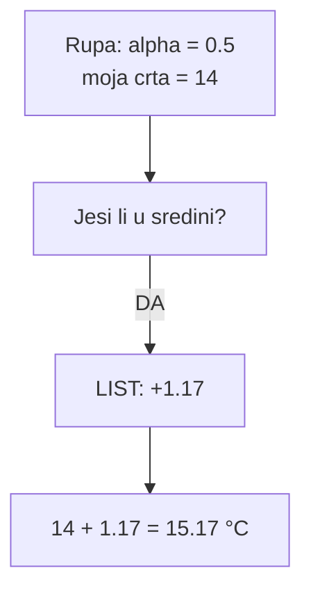
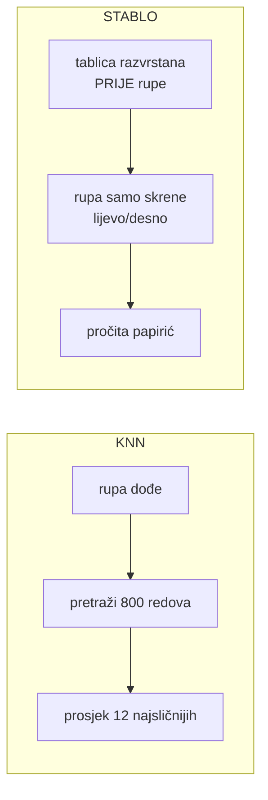
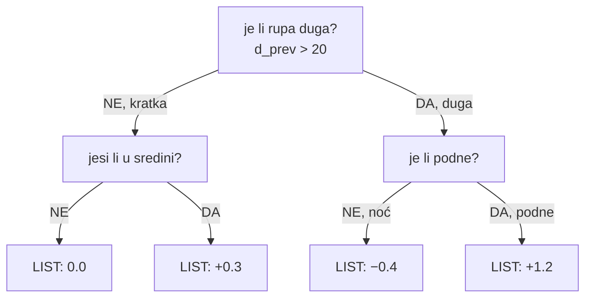
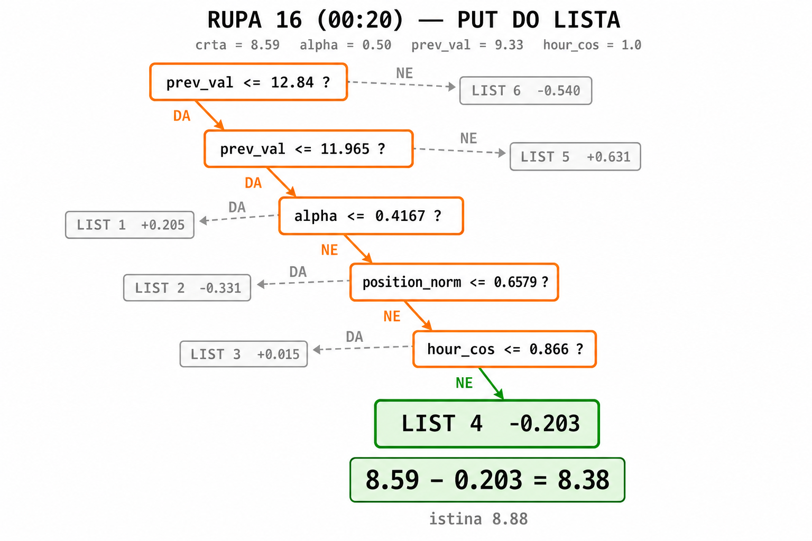

# Stablo — objašnjenje sa slikama

Kod: `src/decision_tree.c`

---

## Cijeli tok na jednoj slici


Koraci 3 i 4 rade se **jednom**. Korak 5 se ponavlja za svaku rupu.

---

## 1. Niz s rupama

```
mjesto:  1     2     3     4
T (°C):  10    ?     ?     16
```

Znamo 10 i 16. Fale mjesta 2 i 3.

---

## 2. Ravna crta (prva procjena)

Povučeš crtu od lijevog poznatog do desnog poznatog.

```
  16 ┤                        ● 16
     │                   ○
     │              ○
  10 ┤ ● 10
     └──┬─────┬─────┬─────┬──
        1     2     3     4

  ● poznato      ○ procjena s crte
```

Od mjesta 1 do mjesta 4 su **3 koraka**:

```
razlika = 16 − 10 = 6

mjesto 2 = 10 + (1/3) × 6 = 12
mjesto 3 = 10 + (2/3) × 6 = 14
```

Taj razlomak (`1/3`, `2/3`) zove se **alpha** — koliko si prošao puta od lijevog do desnog.

```
alpha = 0    uz lijevi poznati
alpha = 0.5  na pola
alpha = 1    uz desni poznati
```

---

## 3. Tablica grešaka (samo poznate točke)

Crta nije uvijek točna. Podne je toplije nego što crta kaže.

Ali grešku možeš izračunati **samo tamo gdje znaš pravu temperaturu**.

Za svako poznato mjesto:

1. sakrij tu temperaturu
2. povuci crtu između njegovih susjeda
3. `greška = prava temperatura − crta`

Dobiješ tablicu:

| situacija | greška crte |
|-----------|-------------|
| uz rub | 0.0 |
| uz rub | 0.1 |
| sredina rupe | +1.2 |
| sredina rupe | +1.0 |
| sredina rupe | +1.3 |
| uz rub | 0.0 |

Čita se: **u sredini rupe crta je bila oko 1,2 °C preniska. Uz rub je pogodila.**

Rupa u ovoj tablici **nema red**. Njoj fali temperatura, pa nema od čega izračunati grešku.

---

## 4. Stablo = tablica razvrstana u fascikle


Postavi se pitanje koje tablicu razdvoji u dvije **čiste** hrpe:

> Jesi li u sredini rupe?

- **NE** → hrpa s greškama 0.0, 0.1, 0.0 → prosjek **0.0**
- **DA** → hrpa s greškama +1.2, +1.0, +1.3 → prosjek **+1.17**

Ta dva prosjeka se **izračunaju sada** i spreme.



### Što je „list"

List je mala kutija u memoriji s jednim brojem:

```c
struct DtNode {
    int is_leaf;   // 1 = ovo je list
    double value;  // <-- ovdje stoji broj, npr. 1.17
    ...
};
```

„Upisati na list" znači samo `node->value = 1.17;`

Kao žuti papirić s brojem. Rupa ga pročita. Papirić se ne mijenja.

### Gdje se listovi spremaju

**Ne u listu ni u polje.** Svaki čvor je zaseban blok u memoriji (`calloc`), a čvorovi su povezani pokazivačima `left` i `right`.

Postoji samo jedna varijabla — `tree`, pokazivač na korijen. Sve ostalo visi na njemu:

```
tree ──► [ pitanje: alpha ≤ 0.4 ]
              left │      │ right
                   ▼      ▼
        [ LIST 0.0 ]   [ pitanje: podne? ]
                            left │   │ right
                                 ▼   ▼
                      [ LIST −0.4 ] [ LIST +1.2 ]
```

Nema `listovi[]`, nema brojača, nema imena. List `+1.2` postoji samo kao „desno dijete desnog djeteta korijena”.

Zato rupa **mora hodati** od korijena — nema načina da skoči direktno na list:

```c
while (!node->is_leaf) {
    node = (znacajka <= prag) ? node->left : node->right;
}
return node->value;
```

Brisanje ide rekurzivno kroz cijelo stablo (`dt_free`): prvo djeca, onda roditelj. Ništa se ne sprema na disk.

### Hod kroz blokove, s adresama



Blokovi **ne sadrže** jedan drugoga. Svaki samo zna **adrese** svoje dvoje djece.

Rupa: `alpha = 0.6`, `d_prev = 50`, crta = 14.

| korak | gdje stoji | što vidi | odluka | kamo dalje |
|-------|-----------|----------|--------|------------|
| 1 | `0x100` | `is_leaf=0`, pitaj `alpha ≤ 0.4` | 0.6 nije ≤ 0.4 → **NE** | `right` = `0x300` |
| 2 | `0x300` | `is_leaf=0`, pitaj `d_prev ≤ 20` | 50 nije ≤ 20 → **NE** | `right` = `0x500` |
| 3 | `0x500` | `is_leaf=1` → **stani** | pročitaj `value` | `+1.2` |

Rezultat: `14 + 1.2 = 15.2 °C`

Blokovi `0x200` i `0x400` postoje u memoriji, ali ta rupa tamo **nikad nije skrenula**.

Program u svakom trenutku pamti samo **jednu** adresu — onu na kojoj stoji. Sljedeća mu je zapisana u bloku na kojem već stoji. Zato blokovi mogu biti razbacani po memoriji; drži ih zajedno samo adresa, ne redoslijed.

Nije lanac `1 → 2 → 3`, nego grananje: na svakom bloku birateš **jednu** stranu, druga se nikad ne posjeti. Od 100 blokova rupa prođe kroz 5 ili 6.

---

## 5. Rupa dobije broj

Rupa **ne pretražuje tablicu**. Samo odgovori na pitanje i pročita papirić.



Druga rupa, `alpha = 0.1`, crta 12:

- pitanje → **NE** → list `0.0`
- rezultat: 12 + 0 = **12**

Isto stablo. Različiti listovi. Različite temperature.

---

## Ključna razlika: KNN vs stablo

Ovo je mjesto gdje se najlakše zapetljati.

| | Napredni KNN | Stablo |
|--|--------------|--------|
| kad se traži sličan slučaj | **kad rupa dođe** | **unaprijed** |
| što radi rupa | pretraži cijelu tablicu | odgovori na pitanja |
| što uzme | prosjek 12 najsličnijih | gotov broj s papirića |

Oba na kraju zalijepe grešku sa sličnih mjesta. Razlika je samo **kad** se ta sličnost traži.



---

## Više pitanja

Ako u hrpi greške i dalje nisu slične, hrpa se opet raspoloviti novim pitanjem.



Najviše **8** pitanja zaredom (`DT_MAX_DEPTH 8`).

Ne prolazi se uvijek svih 8. Stane ranije ako:

- u hrpi ostane manje od 8 poznatih točaka (treba 4 lijevo + 4 desno)
- nijedna podjela ne pomaže (greške su već slične)

Zato su grane različite dužine.

---

## O čemu smije pitati (11 značajki)

Pitanja nisu napisana u kodu. Program ih bira iz ovih 11 brojeva:

| # | značajka | pitanje glasi otprilike |
|---|----------|--------------------------|
| 0 | `prev_val` | koliko je topao lijevi susjed |
| 1 | `next_val` | koliko je topao desni susjed |
| 2 | `alpha` | jesi li bliže lijevom rubu |
| 3 | `d_prev` | koliko je daleko lijevi oslonac |
| 4 | `d_next` | koliko je daleko desni oslonac |
| 5 | `lin_base` | što kaže sama crta |
| 6 | `position_norm` | jesi li na početku ili kraju tjedna |
| 7–8 | `hour_sin`, `hour_cos` | doba dana |
| 9–10 | `yday_sin`, `yday_cos` | doba godine |

Svako pitanje ima isti oblik:

> je li *ovaj broj* ≤ *neki prag*?

Prag se **nauči**. Ako u kodu vidiš 0,4 — to nije upisano, nego je na tim podacima najbolje razdvojilo greške.

---

## Jesu li brojevi na listovima fiksni

**Da**, dok se rupe pune. Rupa samo čita.

Ako 50 rupa padne u isti list, sve dobiju isti `+1.17`. Konačne temperature su ipak različite jer svaka ima svoju crtu.

**Mijenjaju se** samo kad se stablo gradi ponovno:

- drugi tjedan → druge poznate točke → druga tablica → drugi listovi
- druga maska ili stopa → isto

Nakon punjenja `dt_free` obriše stablo. Ne sprema se na disk. Zato nema „jednog stabla" za cijeli rad, nego po jedno za svaku kombinaciju tjedan × scenarij × stopa.

---

## Stvarni primjer iz Jena podataka

`window_00.csv`, 1. siječnja 2009., mjerenje svakih 10 min.

Maknemo 12:20 i 12:30:

```
12:00  12:10  12:20  12:30  12:40  12:50
−6.87  −6.77    ?      ?    −6.51  −6.21
```

**Ravna crta:**

```
razlika = −6.51 − (−6.77) = 0.26

12:20 → alpha = 1/3 → −6.77 + 0.087 = −6.68
12:30 → alpha = 2/3 → −6.77 + 0.173 = −6.60
```

**Tablica grešaka** (dio, samo poznate):

| vrijeme | prava T | crta bez nje | greška |
|---------|---------|--------------|--------|
| 12:00 | −6.87 | −6.77 | −0.10 |
| 12:10 | −6.77 | −6.78 | +0.01 |
| 12:40 | −6.51 | −6.35 | −0.16 |
| 12:50 | −6.21 | −6.20 | −0.01 |

Greške su sitne (~0,1 °C) jer se Jena u 10 minuta skoro ne mijenja.

**Rezultat:** stablo doda tu malu korekciju. Prava vrijednost 12:20 bila je −6.70, crta je dala −6.68. Već je skoro pogodila.

Zato ML na scenariju `random` (kratke rupe) nema što popraviti — i zato u rezultatima linearna interpolacija pobjeđuje.

---

## Veliki primjer: 20 uzoraka, cijelo stablo, sve rupe

Izračunato skriptom `scripts/_primjer_stablo_20.py` na `window_01.csv` (3. lipnja 2009., uzorak svaki sat). Skripta koristi `min_leaf = 2` i veću dubinu kako bi stablo imalo više listova i moglo se nacrtati; pravi kod ima `min_leaf = 4` i dubinu 8.

### Niz

| i | sat | istina °C | | i | sat | istina °C | |
|---|-----|-----------|---|---|-----|-----------|---|
| 0 | 08:20 | 10.56 | | 10 | 18:20 | 11.78 | |
| 1 | 09:20 | 10.53 | | 11 | 19:20 | 11.10 | **RUPA** |
| 2 | 10:20 | 11.34 | | 12 | 20:20 | 9.88 | |
| 3 | 11:20 | 10.97 | **RUPA** | 13 | 21:20 | 9.64 | |
| 4 | 12:20 | 11.93 | **RUPA** | 14 | 22:20 | 9.72 | |
| 5 | 13:20 | 12.38 | | 15 | 23:20 | 9.33 | |
| 6 | 14:20 | 12.86 | | 16 | 00:20 | 8.88 | **RUPA** |
| 7 | 15:20 | 12.82 | | 17 | 01:20 | 7.84 | |
| 8 | 16:20 | 13.73 | | 18 | 02:20 | 7.39 | |
| 9 | 17:20 | 12.15 | | 19 | 03:20 | 7.36 | |

16 poznatih, 4 rupe.

### Tablica grešaka (samo 16 poznatih)

| i | sat | T | crta | greška | alpha |
|---|-----|---|------|--------|-------|
| 0 | 08:20 | 10.56 | 10.53 | +0.030 | 0.00 |
| 1 | 09:20 | 10.53 | 10.95 | −0.420 | 0.50 |
| 2 | 10:20 | 11.34 | 10.99 | +0.348 | 0.25 |
| 5 | 13:20 | 12.38 | 12.48 | −0.100 | 0.75 |
| 6 | 14:20 | 12.86 | 12.60 | +0.260 | 0.50 |
| 7 | 15:20 | 12.82 | 13.29 | −0.475 | 0.50 |
| 8 | 16:20 | 13.73 | 12.48 | **+1.245** | 0.50 |
| 9 | 17:20 | 12.15 | 12.75 | −0.605 | 0.50 |
| 10 | 18:20 | 11.78 | 11.39 | +0.387 | 0.33 |
| 12 | 20:20 | 9.88 | 10.35 | −0.473 | 0.67 |
| 13 | 21:20 | 9.64 | 9.80 | −0.160 | 0.50 |
| 14 | 22:20 | 9.72 | 9.48 | +0.235 | 0.50 |
| 15 | 23:20 | 9.33 | 9.09 | +0.237 | 0.33 |
| 17 | 01:20 | 7.84 | 8.04 | −0.197 | 0.67 |
| 18 | 02:20 | 7.39 | 7.60 | −0.210 | 0.50 |
| 19 | 03:20 | 7.36 | 7.39 | −0.030 | 1.00 |

### Stablo koje je izašlo — 6 listova, ne 8

Dubina 8 **ne znači** 8 listova. Broj listova ne biraš, ispadne iz podataka. Ovdje se grupe potroše na 6.

```
korijen: prev_val ≤ 12.84 ?
├─ DA: prev_val ≤ 11.965 ?
│   ├─ DA: alpha ≤ 0.4167 ?
│   │   ├─ DA:  LIST 1  +0.205   (n=3)
│   │   └─ NE: position_norm ≤ 0.6579 ?
│   │       ├─ DA:  LIST 2  −0.331   (n=3)
│   │       └─ NE: hour_cos ≤ 0.866 ?
│   │           ├─ DA:  LIST 3  +0.015   (n=3)
│   │           └─ NE:  LIST 4  −0.203   (n=2)
│   └─ NE:  LIST 5  +0.631   (n=3)
└─ NE:  LIST 6  −0.540   (n=2)
```

Odakle brojevi na listovima — svaki je prosjek grešaka svojih točaka:

| list | poznate točke | njihove greške | prosjek |
|------|---------------|----------------|---------|
| 1 | 0, 2, 15 | +0.030, +0.348, +0.237 | **+0.205** |
| 2 | 1, 5, 12 | −0.420, −0.100, −0.473 | **−0.331** |
| 3 | 13, 19, 14 | −0.160, −0.030, +0.235 | **+0.015** |
| 4 | 18, 17 | −0.210, −0.197 | **−0.203** |
| 5 | 10, 6, 8 | +0.387, +0.260, +1.245 | **+0.631** |
| 6 | 7, 9 | −0.475, −0.605 | **−0.540** |

Grane su različite dužine: do lista 6 stigneš u **1** pitanju, do lista 4 u **5**.

### Put zadnje rupe (i = 16, 00:20)



| pitanje | njezina vrijednost | prag | odgovor |
|---------|-------------------|------|---------|
| `prev_val` | 9.33 | ≤ 12.84 | DA |
| `prev_val` | 9.33 | ≤ 11.965 | DA |
| `alpha` | 0.50 | ≤ 0.4167 | NE |
| `position_norm` | 0.842 | ≤ 0.6579 | NE |
| `hour_cos` | 1.00 | ≤ 0.866 | NE |

→ **LIST 4 = −0.203**

```
8.59 − 0.203 = 8.38 °C      (istina 8.88)
```

Odakle njezini brojevi:

- `prev_val` = 9.33 → zadnja poznata prije rupe (23:20)
- `position_norm` = 16/19 = 0.842 → rupa je blizu kraja niza
- `hour_cos` = 1.0 → u ponoć je kosinus na vrhu ciklusa

### Sve četiri rupe — stablo je ovdje pogoršalo rezultat

| rupa | istina | crta | greška crte | stablo | greška stabla |
|------|--------|------|-------------|--------|---------------|
| 3 | 10.97 | 11.69 | 0.72 | 11.89 | 0.92 |
| 4 | 11.93 | 12.03 | 0.10 | 11.70 | 0.23 |
| 11 | 11.10 | 10.83 | 0.27 | 10.50 | 0.60 |
| 16 | 8.88 | 8.59 | 0.29 | 8.38 | 0.50 |

MAE crte **0.345 °C**, MAE stabla **0.563 °C**.

Ovo nije greška u primjeru — to je nalaz rada. Na kratkim rupama crta je već dobra, a naučena korekcija unosi šum. Zato `decision_tree` (2.585 °C) gubi od `linear_interpolation` (2.512 °C).

---

## Zapamti

```
temperatura rupe = ravna crta + broj s lista
```

| | Gradnja | Punjenje |
|--|---------|----------|
| tko | samo poznate točke | samo rupe |
| što se radi | pravi se stablo | čita se stablo |
| koliko puta | jednom | za svaku rupu |

Jedna rečenica za obranu:

> Od poznatih mjerenja izračunam koliko linearna interpolacija griješi. Te greške razvrstam u grupe pitanjima da/ne i svakoj grupi zapišem prosjek. Svaka nedostajuća točka prođe ta pitanja i dobije korekciju koja se doda na njezinu ravnu crtu.
