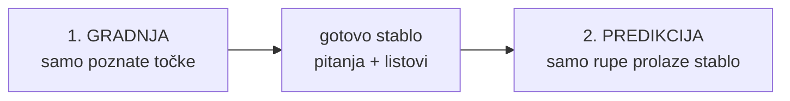
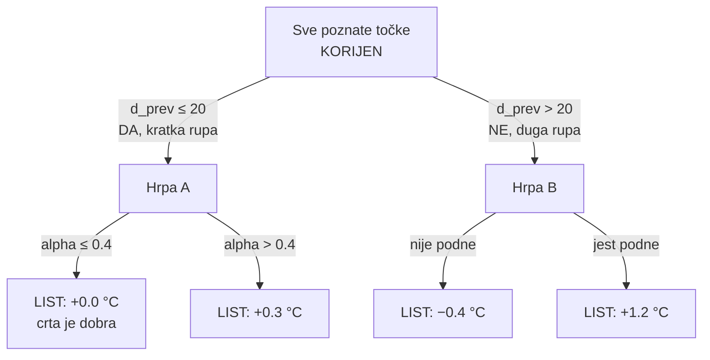
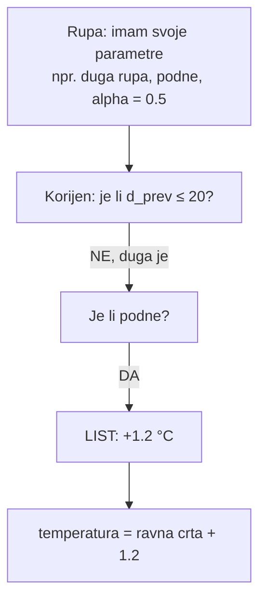

struklc# Regresijsko stablo — jednostavno objašnjenje

Kod: `src/decision_tree.c`

Ovo nije klasifikacijsko stablo (da/ne klasa). Ovo je **regresijsko** stablo: list daje **broj** (korekciju temperature), ne kategoriju.

---

## 1. Što metoda želi

Rupa nema temperaturu. Prva procjena je uvijek **ravna crta** između lijevog i desnog poznatog susjeda (linearna interpolacija).

Ta crta često nije točna (npr. podne je toplije od crte). Stablo uči **koliko crta obično griješi** u određenoj situaciji, pa tu grešku doda:

```
temperatura rupe = ravna crta + broj iz lista
```

Ako list kaže `0`, ostaje čista linearna interpolacija.

---

## 2. Dva koraka (ovo je cijela metoda)



| Korak | Tko sudjeluje | Što se događa |
|-------|----------------|---------------|
| Gradnja (trening) | samo poznate temperature | od njih se **pravi** stablo |
| Predikcija | samo rupe (`NaN`) | rupa **prođe** gotovo stablo i dobije korekciju |

Poznate točke se **ne mijenjaju**. Kroz stablo **ne idu**. One su samo materijal za gradnju.

---

## 3. Primjer niza

```
indeks:      0     1     2     3     4     5     6
temperatura: 10    ?     ?     16    17    ?     19
             ▲                 ▲     ▲           ▲
             poznate                         rupa
```

- **Poznate:** 10, 16, 17, 19 → od njih se gradi stablo
- **Rupe:** indeks 1, 2 i 5 → tek kad je stablo gotovo, svaka prođe kroz njega

---

## 4. Što jedna točka „ima“ (parametri)

Svaka točka, i poznata i rupa, ima **situaciju** od 11 brojeva. To nisu pitanja. To su ulazi.

Najvažniji:

| Parametar | Jednostavno značenje |
|-----------|----------------------|
| `prev_val` | temperatura lijevog poznatog susjeda |
| `next_val` | temperatura desnog poznatog susjeda |
| `alpha` | jesi li bliže lijevom rubu, sredini ili desnom rubu rupe |
| `d_prev` | koliko je daleko lijevi susjed |
| `d_next` | koliko je daleko desni susjed |
| `lin_base` | što kaže ravna crta |
| sat / dan | ciklički (`sin`/`cos`), da su 23:00 i 00:00 blizu |

Za **poznatu** točku dodatno znaš pravu temperaturu, pa možeš izračunati cilj učenja:

```
greška crte = stvarna temperatura − ravna crta
```

Stablo uči tu grešku, ne samu temperaturu.

Za poznatu točku susjedi se traže **bez nje same**. Inače bi ravna crta bila točno jednaka njoj, greška bi bila 0, i stablo ne bi imalo što naučiti.

---

## 5. Kako se stablo pravi

Zamisli sve poznate točke u jednoj hrpi. To je korijen.

U svakom čvoru traži se **jedno da/ne pitanje** koje tu hrpu najbolje raspolovi.

Pitanje uvijek izgleda ovako:

> je li *ovaj parametar* ≤ *ovaj prag*?

- **DA** → lijevo dijete
- **NE** → desno dijete

Prag nije upisan u kod. Računalo isproba svih 11 parametara i sve moguće pragove, pa uzme podjelu kod koje su greške u lijevoj i desnoj hrpi što **sličnije međusobno** (najmanji SSE).

Zatim se isto ponovi na lijevoj hrpi i na desnoj.

### Kad čvor postane list

Stani i napiši list ako:

- dubina je već 8 (`DT_MAX_DEPTH`), ili
- u hrpi ima premalo točaka (za novi rez treba barem 4 lijevo i 4 desno)

Vrijednost lista = **prosjek grešaka crte** u toj hrpi.



Ovo stablo je **primjer**. U stvarnom pokretu pitanja i pragovi su drugačiji svaki tjedan, jer se uče iz tih podataka. Pravo stablo može imati do 8 razina.

---

## 6. Što se desi s rupom

Rupa **ne gradi** novo stablo. Ne bira nova pitanja. Samo odgovara na već naučena, svojim parametrima.



Dvije rupe slične situacije padnu u isti list → ista korekcija.

---

## 7. Mali brojčani primjer cijelog puta

Rupa u 12:00.

- lijevi susjed 10:00 = 8 °C
- desni susjed 14:00 = 12 °C
- ravna crta u 12:00 = **10 °C**

Rupa prođe stablo i padne u list `+1.2`.

```
10 + 1.2 = 11.2 °C
```

To se upiše umjesto `?`.

Ako bi rezultat iskočio iznad najviše (ili ispod najniže) poznate temperature tog niza, stisne se u taj raspon.

---

## 8. Gdje je to u kodu

Datoteka: `src/decision_tree.c`

| Što | Gdje |
|-----|------|
| Jedan čvor: pitanje ili list | `struct DtNode` |
| Max 8 razina, min 4 točke u listu | `DT_MAX_DEPTH`, `DT_MIN_LEAF` |
| Traži najbolje pitanje | `dt_best_split_for_feature` |
| Rekurzivno gradi stablo | `dt_build` |
| Rupa šeta stablom | `dt_predict` |
| Sve skupa: greška crte → gradi → puni rupe | `decision_tree_imputation` |

Redoslijed u `decision_tree_imputation`:

1. Izračunaj 11 parametara za cijeli niz (`ml_features_build`)
2. Za poznate: `greška = temperatura − lin_base`
3. `tree = dt_build(...)`  ← tu se stablo **pravi**
4. Za svaku rupu: `lin_base + dt_predict(tree, rupa)`  ← tu rupa **prolazi**
5. Obriši stablo (`dt_free`) — ne sprema se u datoteku

Zato nema jednog stabla za cijeli diplomski. Ima ga po jedno za svaki tjedan i svaku masku.

---

## 9. Česta zabuna

| Netočno | Točno |
|---------|--------|
| Svaka točka u nizu prolazi stablo | Samo rupe prolaze, i to tek kad je stablo gotovo |
| List je temperatura | List je korekcija; temperatura = crta + list |
| Pitanja su unaprijed napisana u kodu | Pitanja se uče iz poznatih točaka |
| Svaka rupa dobije svoje stablo | Jedno stablo za cijeli oštećeni niz |
| Stablo se puni rupama | Stablo se gradi od poznatih; rupama se samo predviđa |

---

## 10. Jedna rečenica za obranu

> Regresijsko stablo se trenira samo na poznatim mjerenjima: uči koliko linearna interpolacija griješi u određenoj situaciji. Nedostajuće točke zatim prođu to stablo i dobiju korekciju koja se doda na ravnu crtu.
