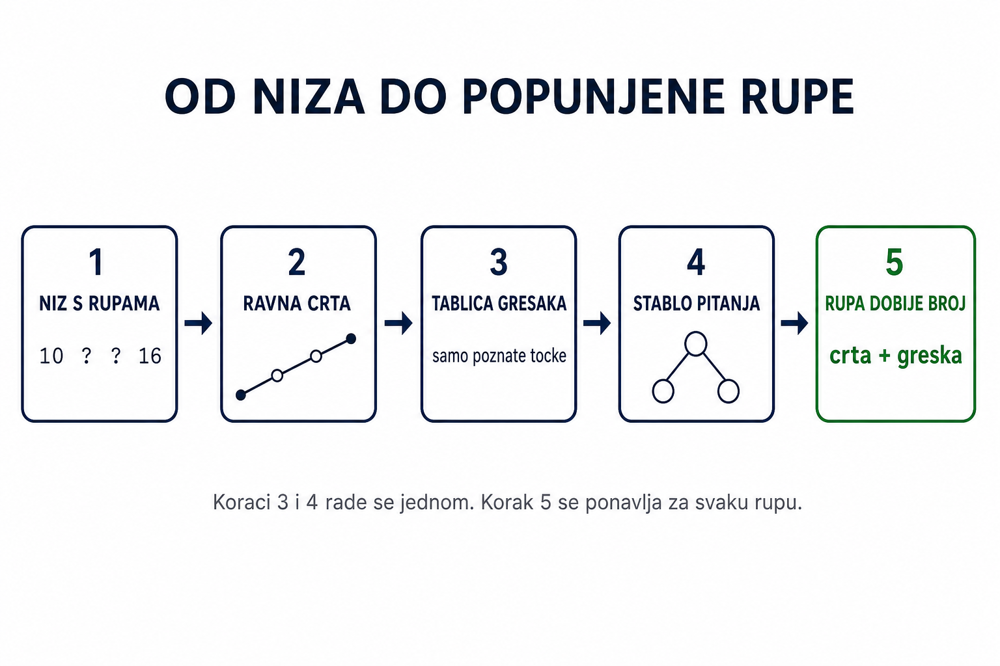
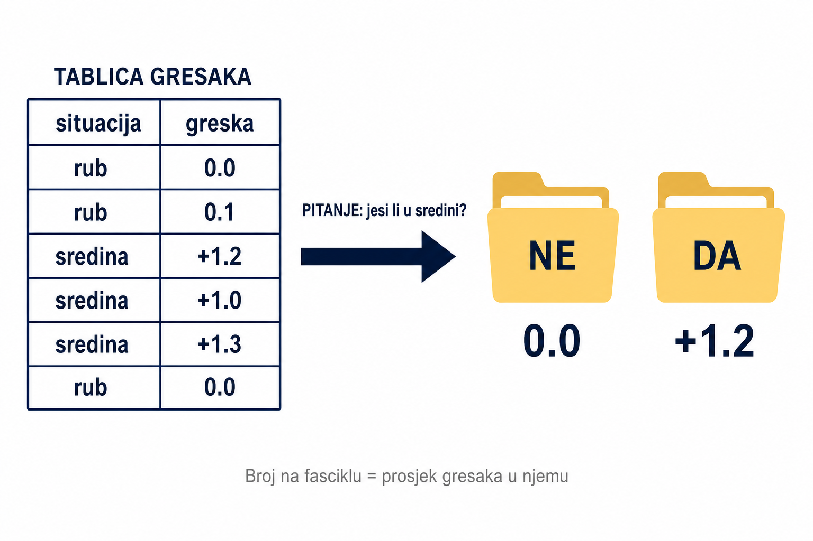
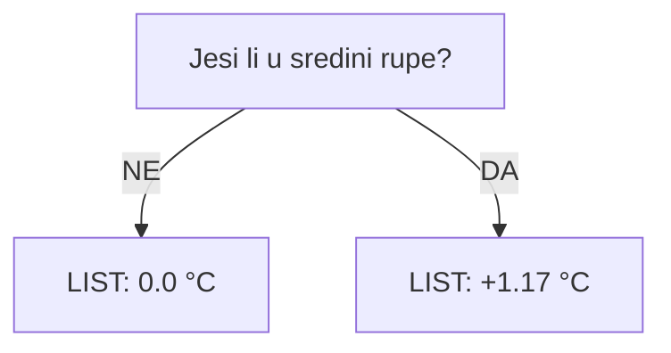
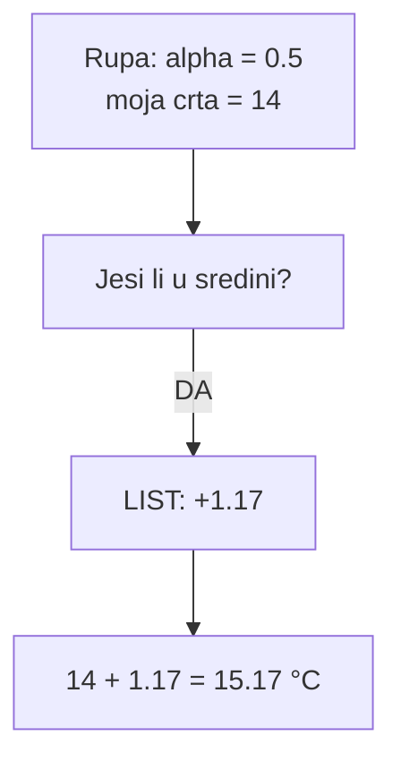
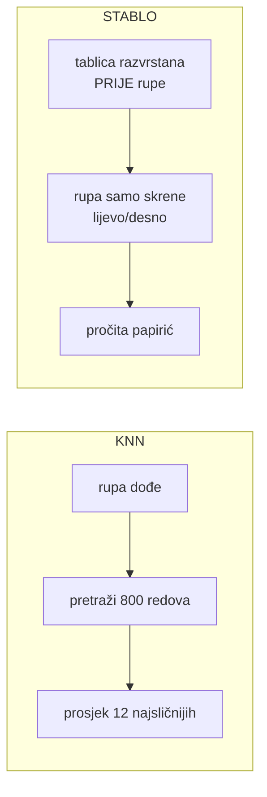
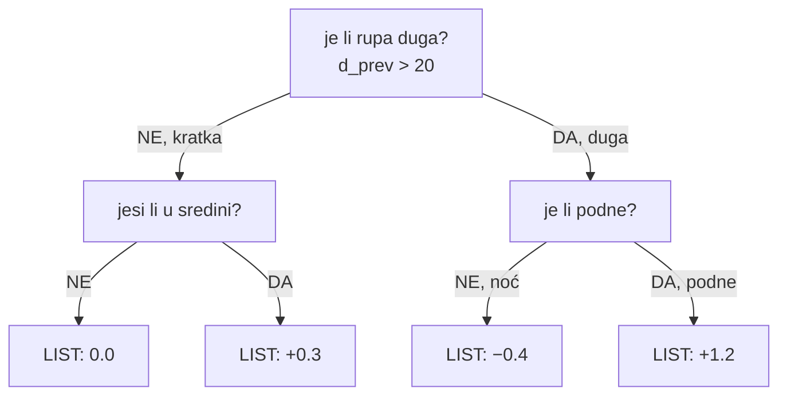

# Stablo — objašnjenje sa slikama

Kod: `src/decision_tree.c`

---

## Cijeli tok na jednoj slici



Koraci 3 i 4 rade se **jednom**. Korak 5 se ponavlja za svaku rupu.

---

## 1. Niz s rupama

```
mjesto:  1     2     3     4
T (°C):  10    ?     ?     16
```

Znamo 10 i 16. Fale mjesta 2 i 3.

---

## 2. Ravna crta (prva procjena)

Povučeš crtu od lijevog poznatog do desnog poznatog.

```
  16 ┤                        ● 16
     │                   ○
     │              ○
  10 ┤ ● 10
     └──┬─────┬─────┬─────┬──
        1     2     3     4

  ● poznato      ○ procjena s crte
```

Od mjesta 1 do mjesta 4 su **3 koraka**:

```
razlika = 16 − 10 = 6

mjesto 2 = 10 + (1/3) × 6 = 12
mjesto 3 = 10 + (2/3) × 6 = 14
```

Taj razlomak (`1/3`, `2/3`) zove se **alpha** — koliko si prošao puta od lijevog do desnog.

```
alpha = 0    uz lijevi poznati
alpha = 0.5  na pola
alpha = 1    uz desni poznati
```

---

## 3. Tablica grešaka (samo poznate točke)

Crta nije uvijek točna. Podne je toplije nego što crta kaže.

Ali grešku možeš izračunati **samo tamo gdje znaš pravu temperaturu**.

Za svako poznato mjesto:

1. sakrij tu temperaturu
2. povuci crtu između njegovih susjeda
3. `greška = prava temperatura − crta`

Dobiješ tablicu:

| situacija | greška crte |
|-----------|-------------|
| uz rub | 0.0 |
| uz rub | 0.1 |
| sredina rupe | +1.2 |
| sredina rupe | +1.0 |
| sredina rupe | +1.3 |
| uz rub | 0.0 |

Čita se: **u sredini rupe crta je bila oko 1,2 °C preniska. Uz rub je pogodila.**

Rupa u ovoj tablici **nema red**. Njoj fali temperatura, pa nema od čega izračunati grešku.

---

## 4. Stablo = tablica razvrstana u fascikle



Postavi se pitanje koje tablicu razdvoji u dvije **čiste** hrpe:

> Jesi li u sredini rupe?

- **NE** → hrpa s greškama 0.0, 0.1, 0.0 → prosjek **0.0**
- **DA** → hrpa s greškama +1.2, +1.0, +1.3 → prosjek **+1.17**

Ta dva prosjeka se **izračunaju sada** i spreme.



### Što je „list"

List je mala kutija u memoriji s jednim brojem:

```c
struct DtNode {
    int is_leaf;   // 1 = ovo je list
    double value;  // <-- ovdje stoji broj, npr. 1.17
    ...
};
```

„Upisati na list" znači samo `node->value = 1.17;`

Kao žuti papirić s brojem. Rupa ga pročita. Papirić se ne mijenja.

---

## 5. Rupa dobije broj

Rupa **ne pretražuje tablicu**. Samo odgovori na pitanje i pročita papirić.



Druga rupa, `alpha = 0.1`, crta 12:

- pitanje → **NE** → list `0.0`
- rezultat: 12 + 0 = **12**

Isto stablo. Različiti listovi. Različite temperature.

---

## Ključna razlika: KNN vs stablo

Ovo je mjesto gdje se najlakše zapetljati.

| | Napredni KNN | Stablo |
|--|--------------|--------|
| kad se traži sličan slučaj | **kad rupa dođe** | **unaprijed** |
| što radi rupa | pretraži cijelu tablicu | odgovori na pitanja |
| što uzme | prosjek 12 najsličnijih | gotov broj s papirića |

Oba na kraju zalijepe grešku sa sličnih mjesta. Razlika je samo **kad** se ta sličnost traži.



---

## Više pitanja

Ako u hrpi greške i dalje nisu slične, hrpa se opet raspoloviti novim pitanjem.



Najviše **8** pitanja zaredom (`DT_MAX_DEPTH 8`).

Ne prolazi se uvijek svih 8. Stane ranije ako:

- u hrpi ostane manje od 8 poznatih točaka (treba 4 lijevo + 4 desno)
- nijedna podjela ne pomaže (greške su već slične)

Zato su grane različite dužine.

---

## O čemu smije pitati (11 značajki)

Pitanja nisu napisana u kodu. Program ih bira iz ovih 11 brojeva:

| # | značajka | pitanje glasi otprilike |
|---|----------|--------------------------|
| 0 | `prev_val` | koliko je topao lijevi susjed |
| 1 | `next_val` | koliko je topao desni susjed |
| 2 | `alpha` | jesi li bliže lijevom rubu |
| 3 | `d_prev` | koliko je daleko lijevi oslonac |
| 4 | `d_next` | koliko je daleko desni oslonac |
| 5 | `lin_base` | što kaže sama crta |
| 6 | `position_norm` | jesi li na početku ili kraju tjedna |
| 7–8 | `hour_sin`, `hour_cos` | doba dana |
| 9–10 | `yday_sin`, `yday_cos` | doba godine |

Svako pitanje ima isti oblik:

> je li *ovaj broj* ≤ *neki prag*?

Prag se **nauči**. Ako u kodu vidiš 0,4 — to nije upisano, nego je na tim podacima najbolje razdvojilo greške.

---

## Jesu li brojevi na listovima fiksni

**Da**, dok se rupe pune. Rupa samo čita.

Ako 50 rupa padne u isti list, sve dobiju isti `+1.17`. Konačne temperature su ipak različite jer svaka ima svoju crtu.

**Mijenjaju se** samo kad se stablo gradi ponovno:

- drugi tjedan → druge poznate točke → druga tablica → drugi listovi
- druga maska ili stopa → isto

Nakon punjenja `dt_free` obriše stablo. Ne sprema se na disk. Zato nema „jednog stabla" za cijeli rad, nego po jedno za svaku kombinaciju tjedan × scenarij × stopa.

---

## Stvarni primjer iz Jena podataka

`window_00.csv`, 1. siječnja 2009., mjerenje svakih 10 min.

Maknemo 12:20 i 12:30:

```
12:00  12:10  12:20  12:30  12:40  12:50
−6.87  −6.77    ?      ?    −6.51  −6.21
```

**Ravna crta:**

```
razlika = −6.51 − (−6.77) = 0.26

12:20 → alpha = 1/3 → −6.77 + 0.087 = −6.68
12:30 → alpha = 2/3 → −6.77 + 0.173 = −6.60
```

**Tablica grešaka** (dio, samo poznate):

| vrijeme | prava T | crta bez nje | greška |
|---------|---------|--------------|--------|
| 12:00 | −6.87 | −6.77 | −0.10 |
| 12:10 | −6.77 | −6.78 | +0.01 |
| 12:40 | −6.51 | −6.35 | −0.16 |
| 12:50 | −6.21 | −6.20 | −0.01 |

Greške su sitne (~0,1 °C) jer se Jena u 10 minuta skoro ne mijenja.

**Rezultat:** stablo doda tu malu korekciju. Prava vrijednost 12:20 bila je −6.70, crta je dala −6.68. Već je skoro pogodila.

Zato ML na scenariju `random` (kratke rupe) nema što popraviti — i zato u rezultatima linearna interpolacija pobjeđuje.

---

## Zapamti

```
temperatura rupe = ravna crta + broj s lista
```

| | Gradnja | Punjenje |
|--|---------|----------|
| tko | samo poznate točke | samo rupe |
| što se radi | pravi se stablo | čita se stablo |
| koliko puta | jednom | za svaku rupu |

Jedna rečenica za obranu:

> Od poznatih mjerenja izračunam koliko linearna interpolacija griješi. Te greške razvrstam u grupe pitanjima da/ne i svakoj grupi zapišem prosjek. Svaka nedostajuća točka prođe ta pitanja i dobije korekciju koja se doda na njezinu ravnu crtu.
