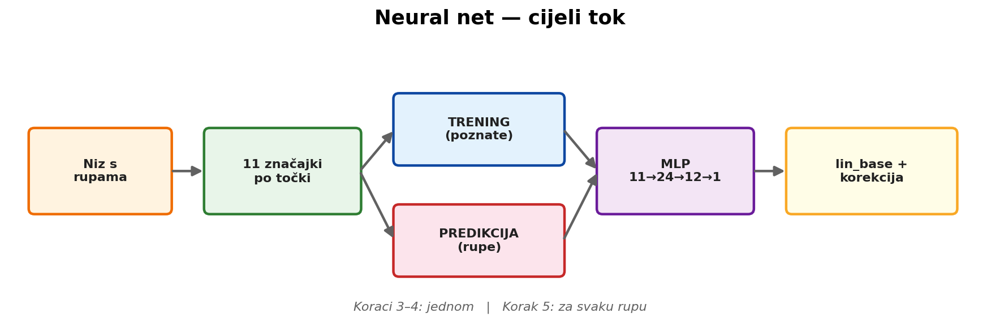
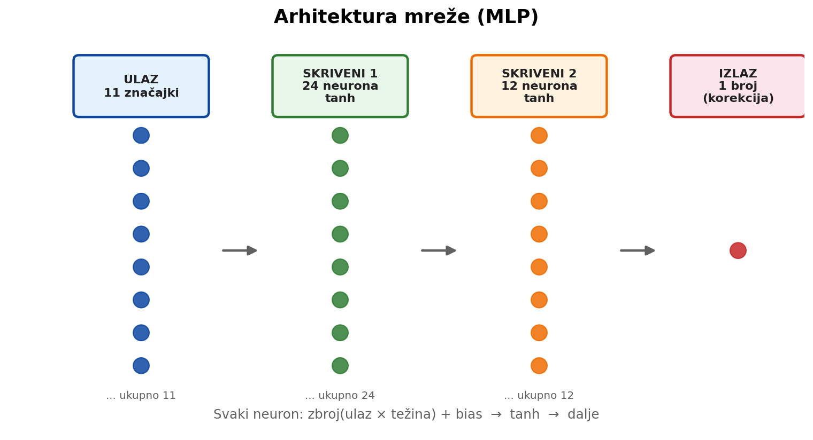
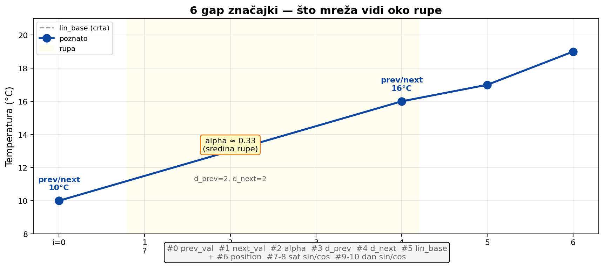
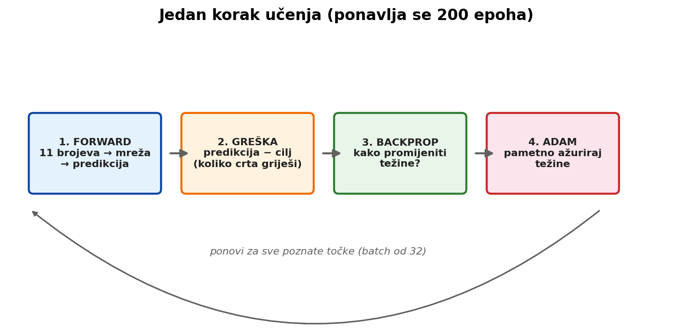
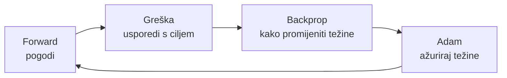
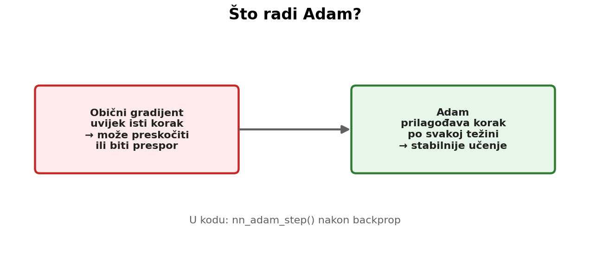
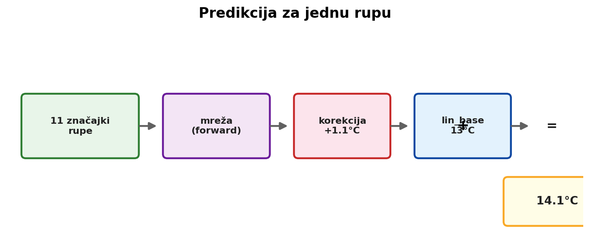
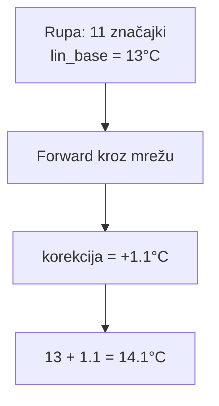
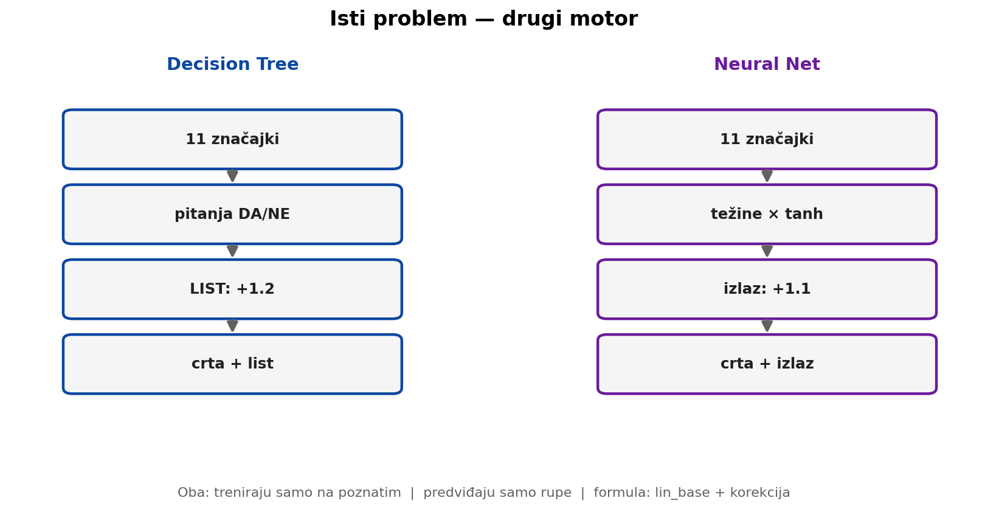

  # Neural net — objašnjenje sa slikama

Kod: `src/neural_net.c`

Ovo je **MLP** (multilayer perceptron) — višeslojna neuronska mreža napisana od nule u C-u.  
Radi **isto što i decision tree**, ali na drugačiji način.

---

## Cijeli tok na jednoj slici



Koraci 3 i 4 rade se **jednom**. Korak 5 se ponavlja za svaku rupu.

---

## 1. Što mreža radi (jedna rečenica)

```
temperatura rupe = lin_base + korekcija_mreže
```

- `lin_base` = ravna crta između susjeda (linearna interpolacija)
- `korekcija_mreže` = broj koji mreža predvidi

Ako mreža kaže `0`, ostaje čista crta.

---

## 2. Niz s rupama

```
mjesto:  0     1     2     3     4     5     6
T (°C):  10    ?     ?     ?    16    17    19
```

Znamo 10, 16, 17, 19. Fale mjesta 1, 2, 3.

**Ravna crta** za mjesto 2:

```
razlika = 16 − 10 = 6
mjesto 2 = 10 + (2/4) × 6 = 13°C   →  to je lin_base
```

Mreža ne uči temperaturu 13°C direktno. Uči **koliko 13 griješi** u toj situaciji.

---

## 3. Arhitektura mreže



| Sloj | Veličina | Aktivacija |
|------|----------|------------|
| Ulaz | **11** značajki | — |
| Skriveni 1 | **24** neurona | tanh |
| Skriveni 2 | **12** neurona | tanh |
| Izlaz | **1** broj | linearno (bez tanh) |

Hiperparametri u kodu:

```c
#define NN_EPOCHS  200    // koliko puta prođeš sve poznate točke
#define NN_BATCH   32     // koliko točaka odjednom
#define NN_LR      0.01   // brzina učenja
```

---

## 4. Što je jedan neuron?

Jedan neuron radi ovo:

```
z = w1·x1 + w2·x2 + ... + w11·x11 + bias
a = tanh(z)
```

- `x` = ulazi (11 značajki)
- `w` = **težine** (uče se tijekom treninga)
- `bias` = pomak
- `tanh` = stisne broj u raspon −1 … +1 (nelinearnost)

**Težina** = koliko je taj ulaz važan za odluku.

---

## 5. Jedanaest značajki na ulazu



Svaka točka (poznata i rupa) ima **karticu** od 11 brojeva.

### Grupa A — 6 gap značajki (oko rupe)

| # | naziv | što znači |
|---|-------|-----------|
| 0 | `prev_val` | temperatura najbližeg poznatog **lijevo** |
| 1 | `next_val` | temperatura najbližeg poznatog **desno** |
| 2 | `alpha` | gdje si u rupi: 0 = uz lijevi rub, 1 = uz desni |
| 3 | `d_prev` | udaljenost do lijevog susjeda (uzorci) |
| 4 | `d_next` | udaljenost do desnog susjeda |
| 5 | `lin_base` | što kaže ravna crta |

### Grupa B — 5 vremenskih značajki

| # | naziv | što znači |
|---|-------|-----------|
| 6 | `position_norm` | gdje si u cijelom nizu (0 = početak, 1 = kraj) |
| 7 | `hour_sin` | sat u danu (ciklički) |
| 8 | `hour_cos` | sat u danu (ciklički) |
| 9 | `yday_sin` | dan u godini (ciklički) |
| 10 | `yday_cos` | dan u godini (ciklički) |

Zašto sin/cos umjesto “sat = 14”?  
Jer 23:00 i 00:00 su **blizu**, a brojevi 23 i 0 su daleko.

**Isti 11 brojeva** koriste i decision tree, i random forest, i neural net.

---

## 6. Što mreža uči (cilj)

Na **poznatim** točkama znaš pravu temperaturu:

```
cilj = stvarna_temperatura − lin_base
     = greška crte
```

Primjer:

| | vrijednost |
|--|------------|
| stvarna temperatura | 14.2°C |
| lin_base (crta) | 13.0°C |
| **cilj (rezidual)** | **+1.2°C** |

Mreža uči predvidjeti taj `+1.2`.

### Zašto rezidual, a ne temperaturu?

Na početku izlazni sloj ima male težine → predikcija ≈ 0 → ostaje crta.  
Mreža uči samo **mali popravak**, ne cijeli oblik temperature.

---

## 7. Kako mreža uči



Petlja se ponavlja **200 epoha** (prolaza kroz sve poznate točke):



### Forward pass

11 brojeva → kroz slojeve → jedan broj (predikcija korekcije).

### Backpropagation

Iz greške na izlazu izračuna se: **koju težinu koliko promijeniti** da sljedeći put bude bolje.

Ne moraš znati formulu — dovoljno: *“greška ide unatrag kroz slojeve”*.

### Adam



**Adam** = pametan optimizer. Za svaku težinu prilagođava veličinu koraka.

| | Obični gradijent | Adam |
|--|------------------|------|
| korak | uvijek isti | prilagođen po težini |
| problem | može preskočiti optimum | stabilnije |

U kodu: `nn_adam_step()` nakon `nn_backward()`.

---

## 8. Predikcija za rupu



Rupa **ne uči** mrežu. Samo koristi već naučenu:



U kodu:

```c
value = lin_base + nn_forward(net, x) * y_sd;
// zatim ograniči na raspon poznatih temperatura
```

---

## 9. Neural net vs Decision Tree



| | Decision Tree | Neural Net |
|--|---------------|------------|
| ulaz | 11 značajki | **istih** 11 |
| što uči | korekciju crte | **istu** korekciju |
| tko trenira | samo poznate | **samo poznate** |
| tko predviđa | samo rupe | **samo rupe** |
| formula | crta + list | crta + izlaz mreže |
| kako odlučuje | pitanja DA/NE | težine + tanh |
| objašnjivost | visoka | niska (“crna kutija”) |

**Isti problem. Drugi motor.**

Na block @ 40% u tvom eksperimentu:

| metoda | MAE |
|--------|-----|
| decision_tree | 2.828°C |
| neural_net | 2.830°C |

Gotovo identično.

---

## 10. Tko sudjeluje — treniranje vs predikcija

| | Treniranje | Predikcija |
|--|------------|------------|
| **tko** | samo poznate točke | samo rupe |
| **što** | podešava težine | čita težine |
| **koliko puta** | 200 epoha | jednom po rupi |

Poznate točke **ne mijenjaju** se u izlazu. Kroz mrežu idu samo da bi se težine naučile.

---

## 11. Gdje je što u kodu

| što | funkcija / konstanta |
|-----|----------------------|
| arhitektura | `NN_IN`, `NN_H1`, `NN_H2` |
| forward pass | `nn_forward()` |
| backpropagation | `nn_backward()` |
| Adam | `nn_adam_step()` |
| cijeli tok | `neural_net_imputation()` |
| 11 značajki | `ml_features_build()` u `ml_features.c` |

Redoslijed u `neural_net_imputation`:

1. Izračunaj značajke za cijeli niz
2. Za poznate: `y = temperatura − lin_base`
3. Standardiziraj ulaze (mean/std samo od poznatih)
4. Treniraj 200 epoha (Adam + backprop)
5. Za rupe: `lin_base + mreža(x)`
6. Obriši mrežu (`free`) — ne sprema se na disk

Zato nema “jedne mreže” za cijeli diplomski — gradi se po jedna za svaki tjedan × masku.

---

## 12. Česta zabuna

| netočno | točno |
|---------|--------|
| mreža uči temperaturu | uči **korekciju** iznad crte |
| svi podaci idu u mrežu | trenira se na **poznatim**, predviđa **rupe** |
| koristi TensorFlow | **implementirano od nule u C-u** |
| mreža se sprema na disk | gradi se svaki put, briše se nakon upotrebe |
| Adam je dio mreže | Adam je **optimizer** — način mijenjanja težina |

---

## 13. Rječnik (5 pojmova)

| pojam | jednostavno |
|-------|-------------|
| **težina** | broj koji mreža uči — koliko je ulaz važan |
| **tanh** | funkcija koja omogućuje zakrivljene obrasce |
| **backprop** | širi grešku unatrag da zna koje težine mijenjati |
| **Adam** | pametan način mijenjanja težina |
| **epoha** | jedan puni prolaz kroz sve poznate točke |

---

## Zapamti

```
temperatura rupe = lin_base + izlaz_mreže
```

| | Treniranje | Predikcija |
|--|------------|------------|
| tko | samo poznate točke | samo rupe |
| što | podešava težine (200×) | jedan forward pass |
| ulaz | 11 značajki + cilj (greška crte) | 11 značajki |

Jedna rečenica za obranu:

> Neuronska mreža je MLP s 11 ulaza i dva skrivena sloja; trenira se samo na poznatim mjerenjima da predvidi rezidual iznad linearne interpolacije, a nedostajuće točke popunjava zbrajanjem te korekcije i linearne baze.
